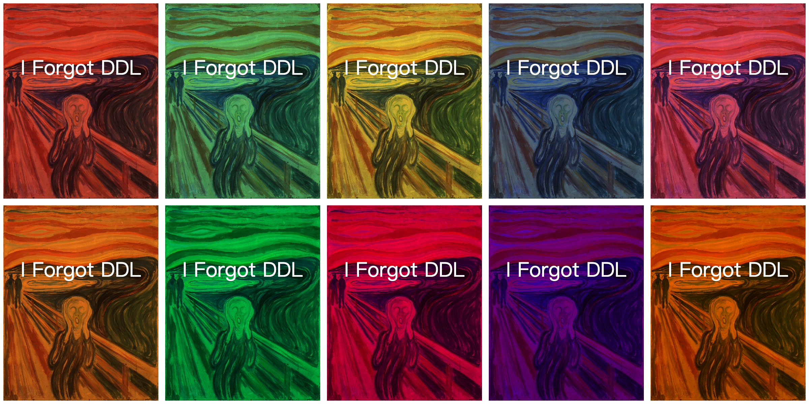
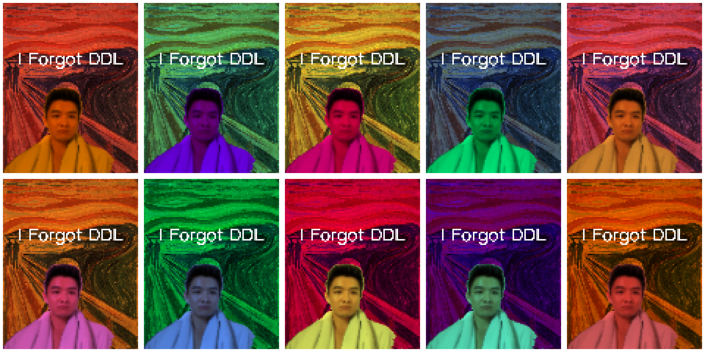
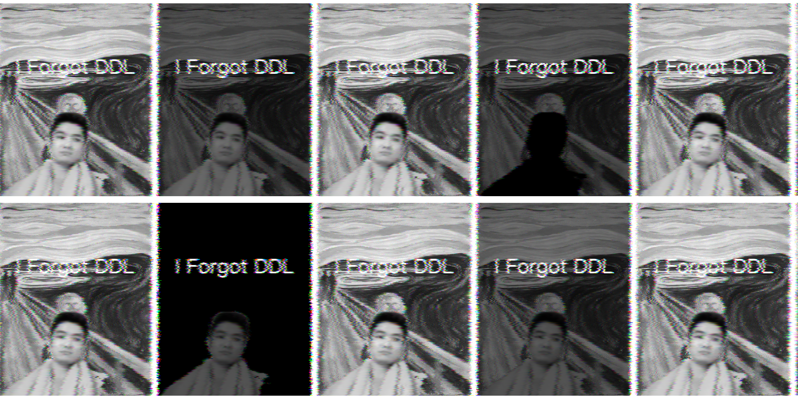

This is an interactive artwork using p5.js + ml5.js, combined with real-time camera human body segmentation, Warhol style dot matrix layout and visual collapse (glitch / RGB offset / red screen warning) effects.

1. Initialization stage (page loading)
Resource loading
Background image (background.jpg)
Dot matrix font (dotMatrix.ttf)
Camera initialization
Get the camera video stream using createCapture()
Set video size and hide the original element
Human segmentation model loading
Load the uNet model from ml5.js asynchronously and start segmentation after loading is complete

2. Main loop stage (draw())
Call different drawing functions based on the runtime t (seconds) for each frame, and the visual effect progresses with time: 

0-20 seconds: Clean / Warhol stage - Draw the background image and the video segmentation result of the camera. - Stitch the video and the background into a 2×5 matrix. - Apply different tone filters to each cell (Warhol style). - Display a clear and artistic image of the person.

20-40 seconds: Light Glitch stage - Slight color flickering. - Enlarge the pixel grains to simulate a slight pixelation. - The RGB channels start to shift, but the person is still recognizable.

40-60 seconds: Glitch stage - The RGB channels drift significantly. - Screen tearing, noise flickering, and frame skipping effects. - The person's face shows ghosting. - The image begins to distort, and the visual confusion increases.

After 60 seconds: Final Collapse stage - The entire screen turns into a red background. - A flashing "ERROR" text (dot matrix font) is displayed in the middle. - Simulate a system crash and a complete visual breakdown.

3. Auxiliary functions
Text status display
Each matrix cell can display text (e.g., "I Forgot DDL").
It can be superimposed with the matrix color blocks and glitch effects.
Filter processing
applyWarholTint() is used for tone changes in different cells.
applyPixelation() can pixelate the image to enhance the glitch effect.
Flickering effect
The ERROR text flashes every second in the red screen stage.

## How to Interact
1. Open the webpage and allow access to the camera.
2. After the page loads, the animation will start automatically.
3. Observe the changes in the picture over time:
   - 0–5 seconds: Clear, artistic matrix display.
   - 5–20 seconds: Color flashing, pixel grains increase.
   - 20–40 seconds: RGB channel drift, noise flickering.
   - After 40 seconds: Red screen flashing with the word "ERROR".

## Technical Explanation
1. **Real-time Human Segmentation**: Use the ml5.js uNet model to perform real-time segmentation on camera video.
2. **Warhol Matrix Layout**: Arrange the segmentation results and background images into a multi-cell matrix and apply different tints through `applyWarholTint()`.
3. **Glitch Effect**: Achieved through RGB channel offset, pixelation, and screen tear functions.
4. **Red Screen Flash ERROR**: Implemented with a time-driven function `drawFinalCollapse(t)`, using dot matrix font and multiple strokes to create a glowing effect.
5. **Timer**: A timer that increments by 1 every second.

## External Tools & References
- The grid font is downloaded from Google Fonts (https://fonts.google.com/download/next-steps).
- The official documentation of p5.js is used for drawing, text, and pixel processing: [p5js.org](https://p5js.org).
- The official documentation of ml5.js is used for human segmentation: [ml5js.org](https://ml5js.org).
- Technical references:
  - RGB glitch technology example: [Glitch Effect Tutorial](https://www.youtube.com/watch?v=ILvxsJcuJf4)

